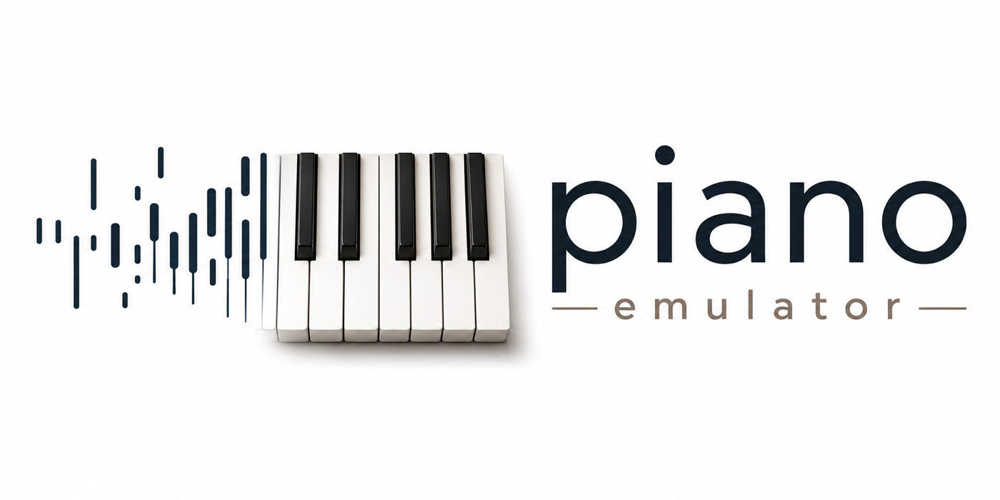

<p align="center">
  
</p>

# piano-emulator

A physically modeled (simulated) grand piano — no samples. Every note is synthesized in real time from a model of the instrument: stiff strings, felt hammers, dampers, pedals, and a soundboard. The design goal is sound quality first, with all model parameters exposed so they can later be fitted automatically to recordings of real pianos (see `TUNING.md`).

## What is modeled

- **Strings** — modal synthesis with stiffness inharmonicity (`f_k = k·f0·√(1+Bk²)`) and frequency-dependent decay. A key's 1–3 strings and their two polarizations are not independent oscillators: they terminate on one bridge point, so each partial is a `2N × 2N` coupled system, solved at preset load into `2N` eigenmodes whose frequencies the bridge pulls together and whose decay rates it pushes apart. The mode that radiates most dies first, which is the fast-attack / slow-aftersound double decay — arriving out of one coupling constant rather than out of a hand-set balance.
- **Unison groups** — 1–3 strings per key, unevenly detuned and unevenly struck, coupled through the bridge: real beating and uneven decay rather than envelope tricks.
- **Hammer** — nonlinear felt (Hunt–Crossley hysteresis) integrated against an explicit agraffe reflection; contact time and brightness vary with key and velocity the way measured grands do.
- **Pedals** — sustain as *continuous* damper lift (half-pedaling works), sostenuto with correct capture semantics, and una corda (softer felt, one string of the group unstruck). Keys from G6 up have no dampers, as on a real grand. A damper that is touching but not seated limits the string nonlinearly, so a half-pedal buzzes rather than merely decaying faster.
- **The action** — the piano's own noises, at the levels they were measured at on a real instrument: the key-off thump on every release (scaled by how fast the key is let go), the damper lifting under a silently pressed key, and the pedal tray going down and coming up, scaled by how many dampers actually move. Panned per key, band-limited like the structure-borne path it travels, and deterministic — the same performance renders the same samples. The levels are ratios to a strike of the same key as a microphone hears it, so the strike they are quoted against is measured through the finished chain when the instrument is built: a preset that voices the piano more quietly takes its action down with it.
- **Touch** — a key pressed too gently to reach escapement lifts its damper and strikes nothing, which is how a pianist prepares sympathetic resonance without the pedal; release velocity sets how fast the damper falls.
- **Sympathetic resonance** — undamped strings pick up energy from everything else that rings; strike-and-release with the pedal down leaves the halo behind. A preset can give the bridge its measured admittance — a mean mobility curve with the board's discrete modes on it — and the halo is then coloured by the board the strings actually share instead of being spectrally flat, while a partial that sits on one of those modes loses energy into the board faster than the smooth fitted decay law says (`radiated_share`: T60 11.3 s against 14.6 s with a flat bridge). `render out.wav halo` is a phrase written to show it. Measured honestly the treble aftersound is still 21 dB short of the instrument it was fitted to — and that gap is on the board's late field rather than on this coupling, which has 0.1 dB of authority over it even at the largest value the stability contract will certify (`DECISIONS.md` 182–184).
- **Duplex and aliquot segments** — the lengths of string beyond the bridge and the agraffe, which have no dampers at all. A preset can give a key up to six of them, at measured frequencies rather than harmonic ratios; they are driven by that key's own bridge force and by the rest of the instrument through the bridge, and neither the key, nor the sustain pedal, nor sostenuto, nor una corda can stop them. Play a treble note staccato and the shimmer stays behind — at the top of the schema's range. At the level the *measured* table currently ships them they are 148 dB below the note and nobody can hear them; the mechanism is right and the drive is wrong — a segment is normalised to answer a **steady** drive at its own frequency, receives only an **impulsive** one, and the factor between those is `1 − r`, a part in ten thousand. Measured at the schema's own ceiling: both segments at +6 dB leave a halo 81.7 dB under their strike, which is under the level the modal culling zeroes, so *no* legal `gain_db` makes one audible. Fixing it re-decides what the field means and is a milestone of its own (`DECISIONS.md` 162, 163, 170, 260, `PHYSICS.md` §3).
- **Soundboard** — body resonances plus a short diffuse-field reverberator, per-key stereo placement, and a master chain with a safety limiter. The two polarizations of a key can be panned apart, so a note's stereo image *moves* as the fast plane dies; a preset may set that spread per key, because one number for the whole compass overshoots the treble by three decibels and undershoots the bass by five.

Full 88-key polyphony with the sustain pedal down runs at roughly a third of one performance core on an M4 Pro (41.6 % on the measured preset, whose duplex segments are never damped). The engine's offline renderer and the live audio path are the same code, so everything measurable in a rendered WAV is what you hear live.

## System requirements

- **macOS on Apple Silicon** (M-series) is the supported target; developed and tuned on an M4 Pro. The audio thread uses aarch64-specific code (FPCR flush-to-zero) and the modal loops are laid out for NEON; other platforms are untested.
- An output device that can run at **48 kHz** (the engine refuses to resample).
- **Rust 1.84+** (`rustup` default toolchain is fine).

## Build & run

```sh
cargo run -p piano-emulator
```

The repository is a cargo workspace: `engine/` is the instrument, `tuner/` is
the offline analysis and parameter-estimation crate `TUNING.md` describes,
`presets/` holds the instrument's parameters as data, and `docs/history/` holds
the investigation records the numbered decisions were made from. `cargo test --release` at
the root runs both crates, including the self-calibration gate, which puts the
tuner's whole estimation pipeline over notes the engine rendered from a known
preset and checks that the parameters come back.

A fourth directory, `forensics/`, is a workspace member but **not** a default
one, so nothing at the root ever builds it: it holds the one-shot instruments
that were each built to settle one question, run, and quoted into a numbered
`DECISIONS.md` item. They are the reproducibility record behind those items and
are built on demand with `cargo build -p forensics`; `forensics/README.md` is
their index. Everything that gets run *again* when the instrument moves — the
preset factory and the standing boards — is a subcommand of the `piano-tuner`
binary instead:

```sh
cargo run -p piano-tuner -- --help
```

```
track / estimate           one recording: trajectories, or the whole analysis
survey                     stage 1, over a whole sample library
fit --stage <name>         stage 2, the per-note fits (see below)
sympathetic                stage 2: duplex, halo coupling, stereo spread
tail                       stage 2: the upper partials' decay
noise                      stage 2: the mechanism's balance against the tone
bench / compass / melody / chain
                           the standing boards, each writing its own document
                           into renders/
score / brilliance / residuals / ab
                           the audits: print, print, print, render
```

**One of those gates is red, on purpose and by name.**

`a_known_duplex_comes_back_from_the_engines_own_render_of_it` fails and has
since the unison became a coupled eigenproblem. It is not a tolerance and it is
not the estimator — with the modal culling switched off the injected segment
comes back at −0.05 cents having rung 1.38 s of the 1.4 s it was given — it is
the duplex bullet below (`DECISIONS.md` 260).

It is left failing rather than skipped because that is the only honest way to
carry a defect nobody has fixed.

`the_hammer_is_no_louder_against_the_note_than_the_pianos_is` is the newest
column of that gate and it is **green** after being written red. A listener
found the engine's hammer noise dominant where the piano's is barely audible;
measured as attack tonality — the arithmetic over the geometric mean of the
first 30 ms of a note, which is a noise-to-tone ratio — the engine came back
**7.1 dB noisier than the recordings** over 150 recorded-key × velocity notes,
while the same engine with `[noise.strike]` silenced came back 7.3 dB *more*
tonal: the event was not filling a 7 dB gap, it was overshooting one by 14.4.
`piano-tuner noise` inverts that exactly — two renders per note, one with the
event silenced, so their difference **is** the burst through the whole chain and
every other level of it is arithmetic — and the answer is a velocity law as much
as a level: 17 dB too loud at pianissimo and 3 dB too loud at fortissimo. Level
−7.29 dB and `velocity_db` 24.4 → 43.9 takes the balance to −0.77 dB, and the
melody column from **−3.90 against a bar of 2.05** to **−1.60**
(`DECISIONS.md` 338-342). One thing found on the way is worth its own line:
`REALISM.md`'s `attack` column detects its onsets on the *reference*, and a
sampler plays each recording from the file's own start, so the engine was being
read a median of **19 ms** past its own attack — every attack number written
before item 338 is quoted through that window and is not comparable with one
written after it.

`no_note_of_the_lines_tail_is_brighter_than_the_rest`, red since it was written,
is **green**. `tuner/tests/melody.rs` renders the Ode to Joy melody line solo
through the engine and through the recordings of the same piano and asks whether
any note stands further off the line's own register trend than the recorded keys
of that register stand off theirs. In the **late** window, 0.5-2.0 s of each
note, C4 stood **5.43 dB off in 2-6 kHz share against a bar of 5.32** — the one
pitch of the line whose `partial_sigma_scale` row was fitted, against four
neighbours whose rows were drawn. The seam turned out to be the band **under
2 kHz**, which `TailCorrection::at` holds at exactly one: `estimate::shaping`
writes it at the 30 recorded keys and nothing ever wrote it at the other 58, so
C4's own cells held its fundamental 4.2 dB higher at 0.5 s than the law alone
would and a *share* metric read that as darkness. `tail::LowDecay` makes that
band a compass quantity like the two above it and the column reads **3.76**,
with C4's own departure at **1.88** (`DECISIONS.md` 334-337).

The default (dev) profile is built with `opt-level = 3` — the DSP is unusable unoptimized — so plain `cargo run`/`cargo test` are real-time capable while keeping fast incremental builds. `--release` additionally enables thin LTO and disables debug assertions; it is the profile performance is measured on, and the performance acceptance test only runs there. The binary opens the default output device and drops you into a REPL:

```
n C4 90            strike C4 at velocity 90 (names like F#3, Bb2; A4 = 440 Hz)
hold C4            press the key silently: the damper lifts, nothing sounds
off C4 [rel]       release the key, optionally at a release velocity
chord C3 E3 G3 95  strike together
ped sus 0.5        sustain pedal (0..1, continuous) — also: sos 0|1, uc 0|1
demo               ~15 s musical demo
render out.wav     render offline to WAV — add `demo`, `halo` (the
                   sympathetic-resonance phrase), or a `.mid` file to replay
panic              everything off
quit
```

The same work can be done without an audio device at all:

```sh
cargo run -p piano-emulator -- render out.wav song.mid --preset presets/default.toml
cargo run -p piano-emulator -- preset my-piano.toml   # write out a preset to edit
```

Tests run with plain `cargo test`; add `--release` to include the performance-budget test:

```sh
cargo test --release
```

**Iteration convention:** iterate with plain `cargo test` (the dev profile is
already `opt-level = 3`, and the release-only perf/calibration gates skip
themselves) and run `cargo test --release --workspace` once before calling work
done — the dev cycle is several times faster because release carries thin LTO
and a single codegen unit for honest perf numbers.

**The measurement tools are parallel and cache what is not under test.** The
batch drivers render tens of independent notes per run — each render builds its
own engine and shares nothing — so they run across the cores, and every parallel
loop collects into an ordered container: `COMPASS.md`, `REALISM.md` and every
rendered file are the same bytes at any thread count. On top of that, the
*reference* side of a comparison is cached to disk under `data/cache/`, keyed by
content, because it does not move when the engine does:

| cache | holds | keyed on |
|---|---|---|
| `data/cache/reference/` | the Salamander recordings played by `piano_tuner::sampler`, as f32 WAV | `sampler::SAMPLER_VERSION`, the SFZ file's bytes, and the phrase (or key and velocity), duration and sample rate asked for |
| `data/cache/calibration/` | the self-calibration gate's tracked notes | a fingerprint of the engine's own audio and the tracker's own output on a probe note, plus the preset TOML, the note and the tracker settings |

Nothing is invalidated by a timestamp or a `--refresh` flag: a changed input
simply hashes to a different name and misses, so an entry is either the answer
to exactly this question or it is not read at all. The one thing hashing cannot
see is a change to the sampler's own code, which is what `SAMPLER_VERSION` is
for — **bump it in the same commit as any change that moves a rendered sample**;
its doc comment says exactly which changes those are. A cache hit is
bit-identical to a fresh render, not merely close, and
`tuner/tests/reference_cache.rs` is the test that says so. The caches are pure
speed: deleting `data/cache/` changes no number anywhere, and `data/` is
gitignored, so a fresh checkout simply starts cold.

Measured on an M4 Pro (`DECISIONS.md` 284): `compass` 39 s -> 4.2 s cold and
3.1 s warm, `bench` 59 s -> 14.3 s and 6.2 s, and
`cargo test --release -p piano-tuner --test calibration` 161 s -> 41 s and 36 s.
The calibration gate's own subsets are named in that file's header.

## Presets

Every number that voices the instrument — the per-note tables (tuning, inharmonicity, decay, unison detuning, strike position, impedance, damper and hammer parameters), the global constants (polarization balance, couplings, the bridge admittance, hammer felt, soundboard) and the action's own noises — lives in a preset file. `--preset <file.toml>` voices both the live engine and offline renders from it; without it the built-in default is used, which is exactly `presets/default.toml`.

The `f0` table is the tuning, so a stretch-tuned (Railsback) instrument is a preset like any other. The default table is equal temperament.

`presets/salamander-c5.toml` is the first preset *measured* rather than tuned by hand: the tuning, inharmonicity (including the signed fourth-order term the wound bass needs), damping, unison detuning, per-string decay spread, stereo directivity and action noise of the Yamaha C5 recorded as the [Salamander Grand Piano](https://freepats.zenvoid.org/Piano/acoustic-grand-piano.html) (Alexander Holm, CC-BY 3.0), estimated from 480 recordings by the tuner. It also carries what only a *second* stage can measure, because it depends on the whole instrument at once rather than on one note: the bridge admittance, the sympathetic coupling, a per-key stereo spread, and 100 duplex segments over 23 keys taken from the library's release-resonance recordings at their measured frequencies — a median of 27 cents off the nearest partial of their own note, which is the scatter that makes a duplex sound like one. Everything the recordings cannot identify — strike position, hammer contact width, felt, soundboard, dampers — is inherited from the default. To reproduce it:

```sh
data/fetch_salamander.sh                       # 707 MiB, checksummed, into the gitignored data/
cargo run --release -p piano-tuner -- survey \
    data/salamander/SalamanderGrandPiano-V3+20200602.sfz \
    --preset presets/default.toml --cache data/cache/salamander \
    --name salamander-c5 --out presets/salamander-c5.toml \
    --credit 'Salamander Grand Piano V3 (Yamaha C5) by Alexander Holm, CC-BY 3.0'
cargo run --release -p piano-tuner -- sympathetic \
    data/salamander/SalamanderGrandPiano-V3+20200602.sfz \
    --preset presets/salamander-c5.toml --out presets/salamander-c5.toml
cargo run --release -p piano-tuner -- fit \
    data/salamander/SalamanderGrandPiano-V3+20200602.sfz \
    --preset presets/salamander-c5.toml --out presets/salamander-c5.toml
cargo run --release -p piano-tuner -- tail \
    data/salamander presets/salamander-c5.toml \
    --passes 8 --out presets/salamander-c5.toml
cargo run --release -p piano-tuner -- noise \
    data/salamander presets/salamander-c5.toml --out /tmp/balanced.toml
cargo run --release -p piano-tuner -- ab      # A/B renders into renders/
cargo run --release -p forensics --bin verify_milestone_b -- [old-preset.toml]
```

`verify_milestone_b` — a `forensics/` instrument, built on demand — re-measures
the sympathetic milestone from rendered audio
with the same code the recordings are measured with — the spectrum census, the
halo isolated by subtraction, render health, neutrality, cost, and what the
between-partial statistic is actually made of. Given the preset as it stood
before a change it prints both columns.

`noise` is last on purpose and writes to a scratch file rather than in place:
it measures the hammer's loudness **against the note**, so it has to run on a
finished instrument, and its correction is inverted on the engine's own render
rather than predicted — which makes it re-entrant, and a second pass over its own
output asks for −0.00 dB. Splice its `[noise.strike]` into the preset and run it
again to see that (`DECISIONS.md` 340).

Being last has a price, and it is written down rather than left to be
rediscovered: `tail` fits its decay correction **on the engine's own render**,
and `noise` then changes that render. Both stages are idempotent on their own —
re-running `tail` against the hammer it was fitted to reproduces the preset with
zero rows differing — but re-running it against the *refitted* hammer moves all
37 drawn `partial_sigma_scale` rows (median cell ×1.004, max ×1.20). So the
shipped preset is one `tail` application short of that stage's fixed point. The
difference is inside every gate's own noise — `mel` 5.10 either way, `attack`
4.39 against 4.42, the compass flagging the same eleven keys, all seven melody
columns passing both ways — so it is reported and not chased; closing the loop
means giving the two stages a shared objective, which is the global optimiser
`TUNING.md` still lists as future work (`DECISIONS.md` 345).

`fit` is stage 2's *motion* half: the within-string false beat (`notes.false_beat`) and the
strike vector's velocity law (`[voicing.strike_direction]`) inverted from the recordings' own beat
depth and rate, `notes.detune_cents` re-fitted where the coupled unison still lets a beat identify
it, and `notes.partial_gains` as the full measured ratio of the recording's time-zero spectrum to
the engine's own render of the same note. Unlike `--stage partials` it is re-entrant: every fit clears
the field it writes from the probe before rendering it. `DECISIONS.md` 239-248.

Its fifth stage, `--stage texture`, is the one that reaches the 58 keys the library never sampled.
A per-partial row and a within-string split are *measurements* and cannot be invented for a key
nobody recorded — but the **distributions** the 28 measured keys carry are statements about the
instrument, and those can be drawn from: how much roughness a row has (register-free, 4.4 dB of
robust spread), how tied neighbouring partials are (lag-1 +0.11), how far up the series a row
reaches, how many splits a wire has and at what rate and depth. Every cell is a draw seeded from
the key number and one named constant, so a re-emitted preset is the same preset; no cell is ever
copied from a neighbour, because the recordings say the roughness is *not* shared between notes at
the same frequency; nothing is drawn that the fitted rows cannot separate from a *colour*, which is
why the tilt is not drawn and a row shorter than four cells is not written; and the drawn rows go
through the same rails, the same power pin and the same close-on-the-render the measured ones do. Which rows were drawn is written down in
`notes.synthesized_texture` so a library that later samples one of those keys can replace them
without guessing. `DECISIONS.md` 284-291.

`survey` is stage 1: everything an isolated recorded note can identify.
`sympathetic` is the other half of stage 2, which is render-and-measure — it fits the duplex
segments from the library's release-resonance recordings, the sympathetic
coupling and bridge admittance by rendering the engine and measuring it against
`docs/history/TUNING_REPORT.md`'s own numbers, and the per-key stereo spread by inverting
each key's drift on a line measured on the engine. Run it without `--out` to
measure and print without writing anything.

## MIDI replay

`render` accepts a standard MIDI file: note on/off on every channel, CC 64 as a *continuous* sustain pedal (half-pedalling survives), CC 66 sostenuto, CC 67 una corda, and the file's tempo map. Events are scheduled against the same event path the keyboard uses, so a replay is a performance the instrument plays rather than a special mode.

## Documentation

The four documents at the root are **live** — each carries a status header
saying what in it is implemented and what is still a plan, and each is expected
to be true of the instrument as it stands today. `docs/history/` holds the
**investigation records**: two long reports that were written to settle a
question, were acted on, and are kept because they are the reasoning and the
measurements behind numbered `DECISIONS.md` items. They describe the instrument
as it was on the day they were written and each says so in a banner at the top.
Where a history document and `DECISIONS.md` disagree, the log wins.

- `SPEC.md` — the model specification and acceptance tests. **Live**, v1 implemented.
- `DECISIONS.md` — the running log of every design decision and deviation. It is the authority: the other documents defer to it.
- `TUNING.md` — the plan for estimating parameters automatically from recordings of real pianos (in progress; stage 1, its self-calibration gate, the first measured preset and most of stage 2 are built, in `tuner/`).
- `PHYSICS.md` — the modelling iterations that are *not* in the instrument yet, ranked, each with the residual it would have to explain. **Live**, and a plan rather than a description.
- `DISTRIBUTION.md` — the plan for turning the engine into an AUv3 plugin. **Live as engineering, moot as commerce**: the project is MIT-licensed and given away, so every pricing, licence-key and in-app-purchase clause in it is dead text and marked as such in its header.
- `docs/history/TUNING_REPORT.md` — **history.** Phase E's measured-vs-model residuals on the Salamander recordings (2026-08-13); acted on in `DECISIONS.md` 98-133, 145-207, 237. The `residuals` subcommand still re-runs the measurements in it.
- `docs/history/FUNDAMENTALS.md` — **history.** The physics review that convicted the free-running unison and derived the coupled one (2026-08-14); acted on in `DECISIONS.md` 223-261 and 296-302. It reviews a string model the engine no longer has.
- `renders/realism/REALISM.md` — the standing realism scoreboard: six fixed phrases rendered from one event list through both the engine and the Salamander recordings, with `TUNING.md`'s stage-2 losses measured over each pair *and* the same measurement between two recordings of the same piano, which is the noise floor that makes the first number readable. It also carries **Columns A and B** (`docs/history/FUNDAMENTALS.md` §II.3): four per-cell measurements of how a single partial *moves* — instantaneous-frequency mismatch and placement, beat-depth error and velocity coherence — over sixteen key × partial cells at three velocities, each with a gate, because every other column on the board is a functional of energy and the artefact those were built to catch is not. All four gates pass on the measured preset (`DECISIONS.md` 253); `cargo run --release -p piano-tuner -- score` is the same four numbers with every cell printed, in seven seconds, for iterating a fit against them. Written by `cargo run --release -p piano-tuner -- bench` (needs `data/fetch_salamander.sh`); the metrics themselves live in `tuner/src/realism.rs` so the scoreboard and the loss an optimizer minimises are one piece of code.
- **The melody gate** is the listener's own test, made permanent
  (`DECISIONS.md` 296-298, 330-331): `cargo test -p piano-tuner --test melody`
  plays the Ode to Joy melody line alone — the soprano of the `excerpt` phrase,
  the same notes from the same `realism::ODE_MELODY` — through the engine and
  through the recordings, measures each note's roughness, beating and 2-6 kHz
  share in **two windows** (0.03-0.40 s of the note, and 0.5-2.0 s of it), and
  asserts that no note stands further off the line's own register trend than a
  real instrument's notes do in that register. A fourth column, `strike`, reads
  the one span the other three deliberately exclude — the first 30 ms, where the
  hammer is — and is gated on a different question: not *does a note stand out*
  but *is the mechanism as loud against the note as the piano's is*, which is a
  comparison with a recording and is therefore scored on the recorded keys of
  the register and never on the transposed ones (`DECISIONS.md` 341). It exists because every other
  standing number here is either a *compass* statistic (88 keys struck alone) or
  a mean over a phrase, and neither of those is a tune with one note wrong in it.
  The late window exists because the first regression it failed to catch was a
  *decay* one, and a window that closes at 0.40 s cannot see a decay; it is read
  off the line's own pitches played slowly and legato, because at the melody's
  tempo the late window of a note contains three later strikes and two of them
  are that note's own harmonics.
  `cargo run --release -p piano-tuner -- melody`
  is the same measurement printed in full, with flags that undo one table at a
  time so a failure can be attributed to the table that causes it; it writes
  `renders/melody/MELODY.md` and the rendered lines beside it, because the
  complaint this gate exists for was made by listening to them.
- **Only recorded reference notes are scored** (`DECISIONS.md` 328-329). The
  Salamander library records 30 of 88 keys, one every minor third, and plays the
  other 58 by resampling the nearest take. Those transposed notes stay in every
  render — they are what a player of this library hears — and they carry no
  *per-note* score: `COMPASS.md`'s `match` column and the melody gate's bars use
  recorded keys only, and everything else is marked `transposed — unscored`
  rather than dropped. On the Ode line that means **only C4 is a recording**;
  D4/E4 are both the D#4 take and F4/G4 are both the F#4 take. The phrase board
  is untouched — a mel distance is a whole performance against a whole
  performance — so the policy appears there as a measured number instead:
  rendering the phrase set through the *second*-nearest take for every
  unrecorded key and scoring it against the first puts **2.67 dB of mel**, 53 %
  of the engine's own distance, on how much of "the reference" at those keys is
  the resampler.
- **Brilliance** has no standing report, because the audit that measured it (`DECISIONS.md` 292-295) moved nothing: `cargo run --release -p piano-tuner -- brilliance` prints, per key and per phrase, how much 2-6 kHz and 6-12 kHz energy the engine carries against the recording of the same note at 0.1 s and at 1 s, each against the reference's own velocity-layer spread. It exists because `COMPASS.md`'s `centroid` is a mean *partial index* and the ear's brightness is absolute. It refused the top octave's decay (the recording's late energy there is its room, 20-30 dB over the note's own partial), acquitted the master shelf on its measured leverage, and convicted the partial envelope above the fitted rows — an error in partial *number* rather than in frequency, and one whose fix is a decay re-fit rather than a filter. The measurements are in `tuner/src/estimate/brilliance.rs`.
- `presets/default.toml` — the hand-tuned v1 instrument, written out in full.
- `presets/salamander-c5.toml` — the same instrument with everything stage 1 could measure off a real Yamaha C5 written into it. Its `notes.partial_gains` and `notes.false_beat` tables now cover the whole compass: 28 keys measured against their own recordings and 50 **drawn** from those keys' distributions, named in `notes.synthesized_texture` (`DECISIONS.md` 284-291, 300). Both halves of a drawn key are closed on the **render** — the row against the recordings' own roughness of that register, the splits against their own beat depth — which is what a fitted key's row and a fitted key's splits are each closed against too.

## Licence

MIT (`LICENSE`), and the instrument is free: there is no paid tier, no licence
key and no in-app purchase anywhere in the plan, which is why
`DISTRIBUTION.md`'s commercial sections are marked moot rather than deleted —
they are still an accurate account of what the Mac App Store requires of anyone
who does charge.

The **recordings** the measured preset was estimated from are not MIT and are
not distributed here: the Salamander Grand Piano V3 is CC-BY 3.0 by Alexander
Holm, credited in `ATTRIBUTION.md`, in `presets/salamander-c5.toml`'s own
`description` field, and by the fetch script that downloads it. What ships in
this repository is the *parameters* estimated from those recordings, not the
audio. Any future library the pipeline is pointed at has to be recorded in
`ATTRIBUTION.md` before its numbers ship in a preset.
